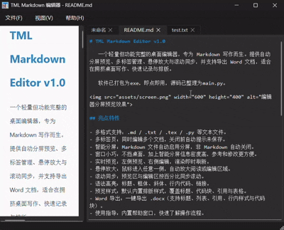

# TML Markdown Editor v1.0

   一个轻量但功能完整的桌面编辑器，专为 Markdown 写作而生。提供自动分屏预览、多标签管理、悬停放大与滚动同步，并支持导出 Word 文档，适合在拥挤桌面写作、快速记录与排版。
   
   软件已打包为exe，即点即用，源码已整理为main.py。演示视频（有概率加载失败变为空白）：

## 亮点特性

- 多格式支持：.md / .txt / .tex / .py 等文本文件。
- 多标签页：同时编辑多个文档，关闭前自动提示未保存。
- 智能分屏：Markdown 文件自动启用分屏，非 Markdown 自动关闭。
- 窗口小巧：不挡桌面，加上智能分屏信息密度高，参考和修改更方便。
- 实时预览：左侧预览、右侧编辑，渲染即时刷新。
- 悬停放大：鼠标进入任意一侧，自动放大阅读或编辑区域。
- 滚动同步：预览区与编辑区按百分比同步滚动。
- 语法高亮：标题、粗体、斜体、行内代码、链接。
- 预览样式：默认内置排版样式，覆盖标题、代码块、引用与表格。
- Word 导出：一键导出 .docx（支持标题、列表、引用、行内样式与代码块）。
- 使用指导：内置帮助窗口，快速了解操作流程。

## 使用方式

- 文件菜单：新建、打开、保存、另存为、导出 Word。
- 视图菜单：预览缩放、分屏模式切换。
- 帮助菜单：查看使用指导。

## 功能一览

- 分屏预览模式：左侧只读预览，右侧源码编辑。
- 自动分屏切换：基于文件扩展名自动判断。
- 预览缩放：支持放大/缩小预览字体。
- 状态栏提示：显示当前文件与操作状态。

## 运行与依赖

- 依赖：PyQt6、markdown、python-docx
- 运行：python main.py

## 适用场景
- 轻量文稿整理与导出
- Markdown 轻写作与排版
- 技术文档草拟与预览

### 目前问题

- Markdown无法通过拖动直接打开
- Markdown中部分图片和公式无法正常显示
- word导出功能欠佳
- 会被其他窗口盖住，不用时应缩到屏幕边

### 联系我们
点击 [我的博客](https://mingchuangyinye.shop/personalpage) 与我们取得联系
